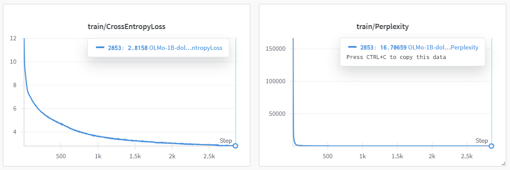

# LLM-pretraining
**Pretraining LLM from scratch base on OLMo package of Ai2**

## Results
We provide an example of pre-training model of 1B parameters with 3.66B token wiki data sub-sampled form [olmo-mix-1124](https://huggingface.co/datasets/allenai/olmo-mix-1124)
- Training logs on wiki data.
  

## Quick Start ▶️

### Prerequisites
- Singularity ≥ 3.6
- Slurm client (optional for local execution)

### Launch Training:
```bash
git clone https://github.com/alexxchen/LLM-pretraining.git
cd LLM-pretraining
./start_run.sh
```
The script will automatically:
1. Pull the pre-built Docker image and convert it into singularity image
2. Launch Slurm job with optimal default parameters
